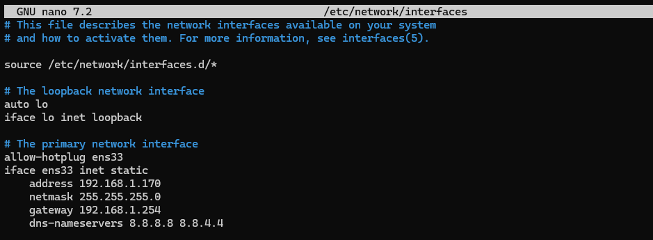
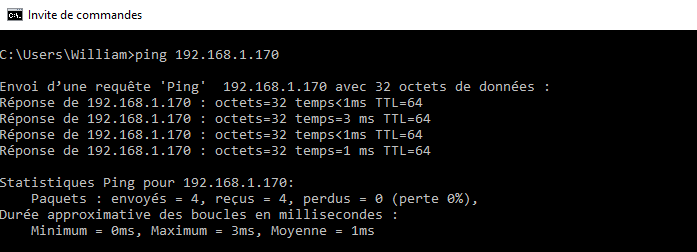
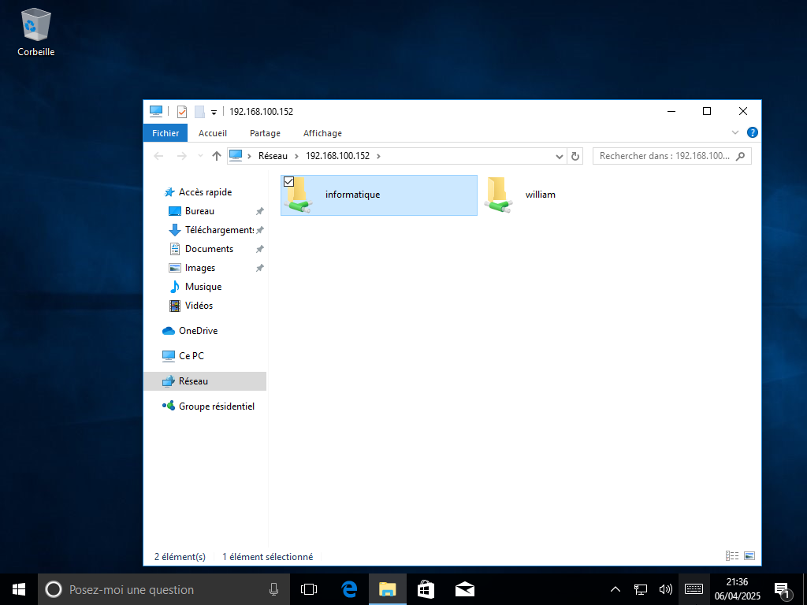
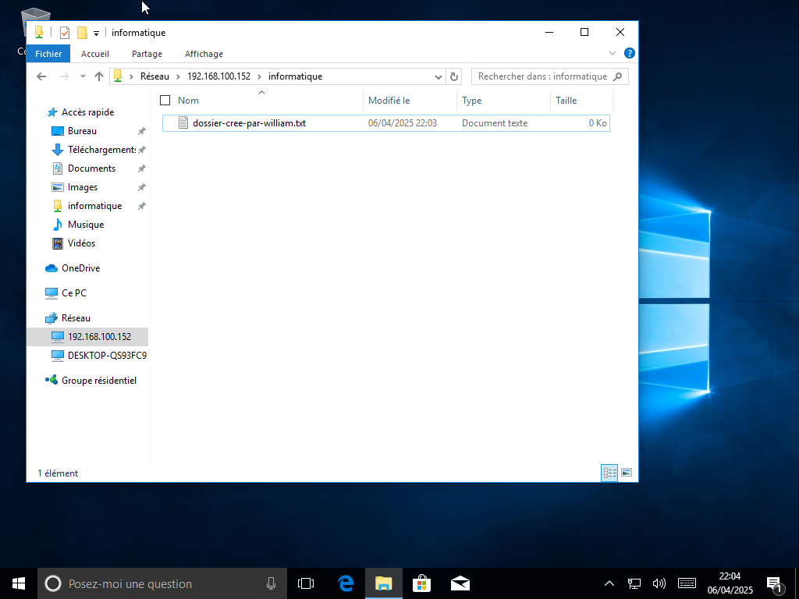
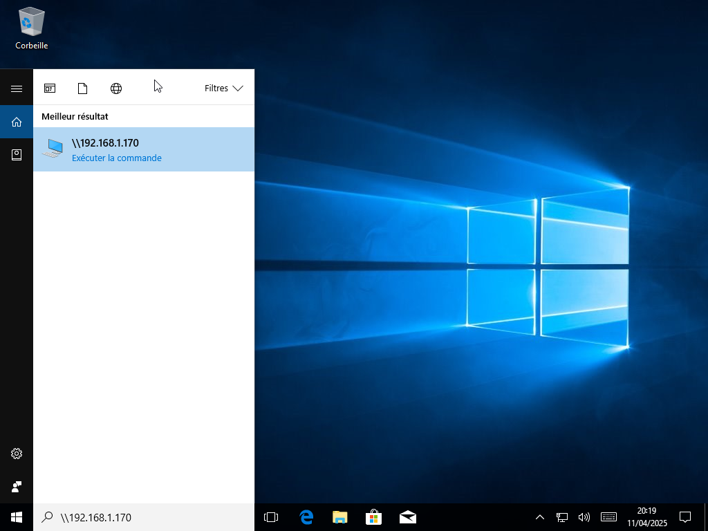
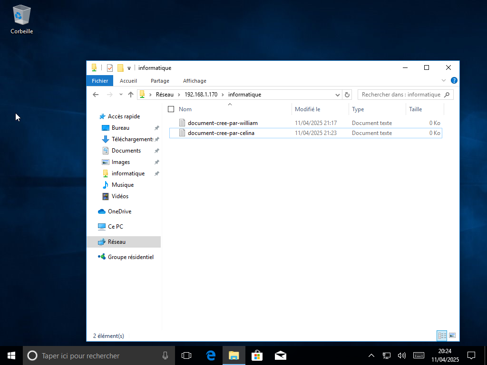
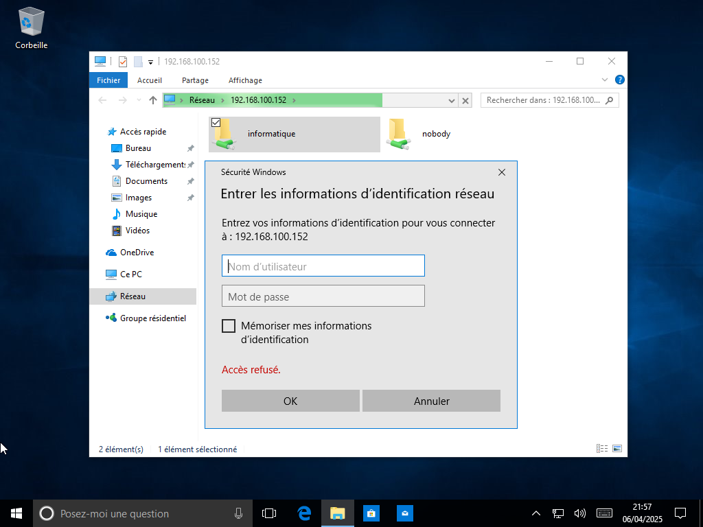
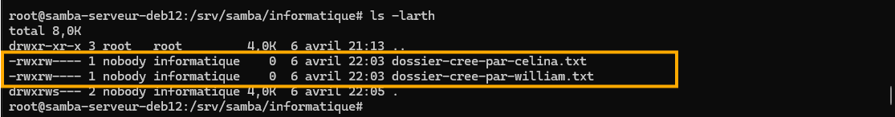

# bts-sisr-cours-1a-samba-serveur-fichiers

## 1. Configuration de l'interface réseau

```bash
apt-get update -y
```

```bash
su -
```

```bash
nano /etc/network/interfaces
```

```bash
# This file describes the network interfaces available on your system
# and how to activate them. For more information, see interfaces(5).

source /etc/network/interfaces.d/*

# The loopback network interface
auto lo
iface lo inet loopback

# The primary network interface
allow-hotplug ens33
iface ens33 inet static
    address 192.168.100.152
    netmask 255.255.255.0
    gateway 192.168.100.2
    dns-nameservers 8.8.8.8 8.8.4.4
```


```bash
systemctl restart networking
```

Sur le client **samba-client-win10** :

Test de connectivité du serveur **samba-serveur-deb12**



## 2. Installation et configuration de Samba

Installation du paquet Samba

```bash
apt install samba samba-common-bin -y
```

Vérification de l'installation de Samba

```bash
smbd --version
```

Création de l'utilisateur Célina

```bash
useradd celina
```

Ajout des utilisateurs Célina et William  à la base d'utilisateurs Samba:

```bash
smbpasswd -a celina
```

```bash
smbpasswd -a william
```

Vérification de l'activation de l'utilisateur 

```bash
smbpasswd -e celina
```

```bash
smbpasswd -e william
```

Affichage de la liste des utilisateurs Samba enregistrés :

```bash
pdbedit -L
```

Création d'un groupe dédié aux utilisateurs

```bash
groupadd informatique
```

Ajout des utilisateurs Célina et William au groupe informatique :

```bash
usermod -aG informatique celina
```

```bash
usermod -aG informatique william
```

Vérification que l'ajout a été effectué

```bash
getent group informatique
```

Redémarrage du service Samba

```bash
systemctl restart smbd && systemctl status smbd
```

Modification du fichier de configuration de Samba

```bash
nano /etc/samba/smb.conf
```

Ajouter ce code à la fin du fichier

```
[informatique]
   path = /srv/samba/informatique
   read only = no
   valid users = @informatique
   force create mode = 0660
   force directory mode = 0770
   directory mask = 0770
   browsable = yes
   writable = yes
   guest ok = no
   force user = nobody
   force group = informatique
   create mask = 0770
```

Vérifier si la syntaxe est correcte

```bash
testparm
```

Redémarrage du service Samba

```bash
systemctl restart smbd && systemctl status smbd
```

Création du dossier /srv/samba/informatique

```bash
mkdir -p /srv/samba/informatique
```

Le répertoire /srv/samba/informatique appartienne à l'utilisateur nobody et au groupe informatique.

```bash
chown nobody:informatique /srv/samba/informatique
```
Modification des permissions :

- Le bit setgid est activé, ce qui signifie que tous les fichiers créés dans ce répertoire auront automatiquement le groupe informatique.

- Le propriétaire (nobody) et les membres du groupe (informatique) ont toutes les permissions (lecture, écriture, exécution).

- Les autres utilisateurs n'ont aucune permission.

```bash
chmod 2770 /srv/samba/informatique
```

## 3. Réalisation de tests

Connexion au dossier partagé et réalisation de test

Sur le client **samba-client-win10**, j'ai créé trois utilisateurs : Celina, William et Luc.

Rappelons que Célina et William sont meme du groupe informatique dans Samba, mais pas Luc. Par conséquent, seuls Célina et William auront accès au dossier informatique.

</br>

### Sur le compte utilisateur de William

</br>






</br>

### Sur le compte utilisateur de Célina

</br>








</br>

### Sur le compte utilisateur de Luc

</br>




</br>

###  Sur le serveur **samba-serveur-deb12**

</br>

```bash
cd /srv/samba/informatique
```

```bash
ls -larth
```



