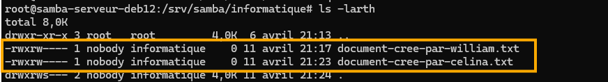
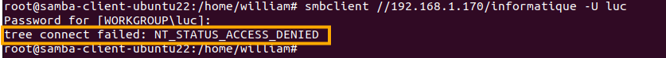
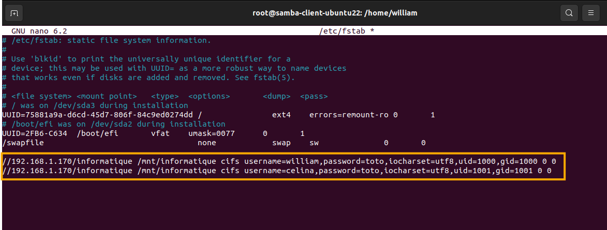
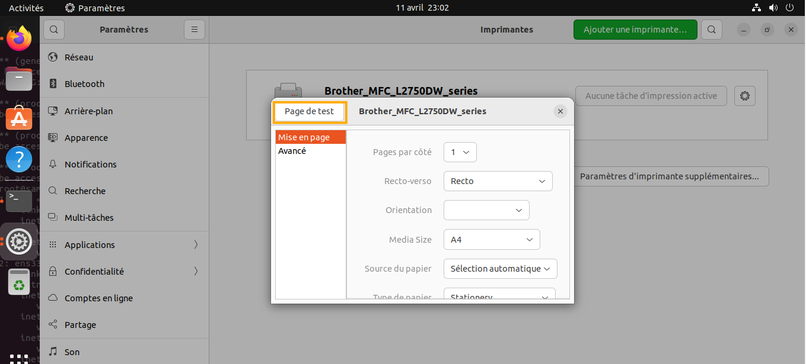

# Partie 1 : Installation de Samba, serveur de fichiers

Nous allons créer un serveur de fichier Samba avec un répertoire Informatique qui sera donc partagé.

Les utilisateurs qui auront accès au répertoire sont : Célina et William, uniquement

Ils auront les droits de création, modification et suppression dans ce répertoire.

Nous allons installer et configurer les serveur Samba, et nous réaliserons les tests de d'accès au répertoires sur des clients Windows et Linux (Ubuntu)


## 1. Configuration de l'interface réseau

```bash
apt-get update -y
```

```bash
su -
```

```bash
nano /etc/network/interfaces
```

```bash
# This file describes the network interfaces available on your system
# and how to activate them. For more information, see interfaces(5).

source /etc/network/interfaces.d/*

# The loopback network interface
auto lo
iface lo inet loopback

# The primary network interface
allow-hotplug ens33
iface ens33 inet static
    address 192.168.1.170
    netmask 255.255.255.0
    gateway 192.168.1.254
    dns-nameservers 8.8.8.8 8.8.4.4
```


```bash
systemctl restart networking
```

## 2. Installation et configuration de Samba

Installation du paquet Samba

```bash
apt install samba samba-common-bin -y
```

Vérification de l'installation de Samba

```bash
smbd --version
```

Création de l'utilisateur Célina

```bash
useradd celina
```

Ajout des utilisateurs Célina et William  à la base d'utilisateurs Samba:

```bash
smbpasswd -a celina
```

```bash
smbpasswd -a william
```

Vérification de l'activation de l'utilisateur 

```bash
smbpasswd -e celina
```

```bash
smbpasswd -e william
```

Affichage de la liste des utilisateurs Samba enregistrés :

```bash
pdbedit -L
```

Création d'un groupe dédié aux utilisateurs

```bash
groupadd informatique
```

Ajout des utilisateurs Célina et William au groupe informatique :

```bash
usermod -aG informatique celina
```

```bash
usermod -aG informatique william
```

Vérification que l'ajout a été effectué

```bash
getent group informatique
```

Redémarrage du service Samba

```bash
systemctl restart smbd && systemctl status smbd
```

Modification du fichier de configuration de Samba

```bash
nano /etc/samba/smb.conf
```

Ajouter ce code à la fin du fichier

```
[informatique]
   path = /srv/samba/informatique
   read only = no
   valid users = @informatique
   force create mode = 0660
   force directory mode = 0770
   directory mask = 0770
   browsable = yes
   writable = yes
   guest ok = no
   force user = nobody
   force group = informatique
   create mask = 0770
```
Explication des paramètres:

```path = /srv/samba/informatique``` définit le chemin du dossier à partager via Samba. C’est ici que les fichiers seront physiquement stockés sur le serveur.

```read only = no``` signifie que le partage n’est pas en lecture seule, donc les utilisateurs peuvent écrire/modifier des fichiers. 


```valid users = @informatique``` signifie que seuls les utilisateurs appartenant au groupe Unix informatique peuvent accéder au partage.


```force create mode = 0660``` signie que lorsqu’un ***fichier*** est créé, il aura par défaut les permissions 660 (lecture/écriture pour l'utilisateur et le groupe). Les autres utilisateurs (Others) n'auront pas accès aux fichiers.


```force directory mode = 0770``` Pareil que ci-dessus, mais pour les répertoires. Lecture, écriture et exécution pour le propriétaire et le groupe ; aucun droit pour les autres.


```directory mask = 0770``` définit les droits maximaux qu’un répertoire peut avoir à sa création. Combine avec force directory mode pour assurer les bons droits.


```browsable = yes``` signifie que le partage sera visible dans le voisinage réseau (explorateur Windows par exemple). Les utilisateurs verront ce partage listé automatiquement.


```writable = yes``` permet explicitement l’écriture sur le partage (équivalent de read only = no). Peut être redondant, mais utile pour la clarté.

```guest ok = no``` signifie que les invités ne sont pas autorisés (pas d’accès sans authentification). Il Sécurise l’accès : seuls les utilisateurs connus peuvent se connecter.

```force user = nobody``` signifie que tous les fichiers créés seront propriétés de l’utilisateur nobody, peu importe qui les a créés.Uniformise les droits sur les fichiers, évite des conflits d’accès. 
nobody est un utilisateur système spécial. Il est utilisé pour représenter un utilisateur “anonyme” ou “sans privilèges”.

```force group = informatique``` signie que tous les fichiers créés appartiendront au groupe informatique. Cela favorise la collaboration dans un groupe de travail.

```create mask = 0770``` définit les droits maximaux pour les fichiers créés. Cela empêche par défaut tout accès pour les "autres", sauf le propriétaire et le groupe.


Vérifier si la syntaxe est correcte

```bash
testparm
```

Redémarrage du service Samba

```bash
systemctl restart smbd && systemctl status smbd
```

Création du dossier /srv/samba/informatique

```bash
mkdir -p /srv/samba/informatique
```

Le répertoire /srv/samba/informatique appartienne à l'utilisateur nobody et au groupe informatique.

```bash
chown nobody:informatique /srv/samba/informatique
```
Modification des permissions :

- Le bit setgid est activé, ce qui signifie que tous les fichiers créés dans ce répertoire auront automatiquement le groupe informatique.

- Le propriétaire (nobody) et les membres du groupe (informatique) ont toutes les permissions (lecture, écriture, exécution).

- Les autres utilisateurs n'ont aucune permission.

```bash
chmod 2770 /srv/samba/informatique
```

## 3. Réalisation de tests sur le client **samba-client-win10** 

### Test de connectivité ping au serveur **samba-serveur-deb12**


### Connexion au dossier partagé et réalisation de test

Sur le client **samba-client-win10**, j'ai créé trois utilisateurs : Celina, William et Luc.

Rappelons que Célina et William sont meme du groupe informatique dans Samba, mais pas Luc. Par conséquent, seuls Célina et William auront accès au dossier informatique.

</br>

### Sur le compte utilisateur de William

</br>


</br>

### Sur le compte utilisateur de Célina

</br>


</br>

### Sur le compte utilisateur de Luc

</br>


</br>

###  Sur le serveur **samba-serveur-deb12**

</br>

```bash
cd /srv/samba/informatique
```

```bash
ls -larth
```




## 3. Réalisation de tests sur le client **samba-client-ubuntu22** 

### Test de connectivité ping au serveur **samba-serveur-deb12**


### Connexion au dossier partagé et réalisation de tests

Sur le client **samba-client-ubuntu22**, j'ai créé deux utilisateurs : Celina et Luc. 

```bash
useradd celina
```

```bash
useradd luc
```

William a été créé lors de l'installation du système d'exploitation.

Rappelons que Célina et William sont membres groupe informatique dans Samba, mais pas Luc. Par conséquent, seuls Célina et William auront accès au dossier informatique.

### Installation du paquet smbclient

```bash 
sudo su
```

```bash 
apt-get install smbclient -y
```

### Connexon au dossier partagé

**William** peut il accéder au dossier partagé **informatique** ? **OUI**

```bash 
smbclient //192.168.1.170/informatique -U william
```
Saisir le mot de passe 

Afficher la liste le contenu du répertoire avec la commande ```ls```

```bash 
ls
```


```bash 
exit
```


**Celina** peut elle accéder au dossier partagé **informatique** ? **OUI**

```bash 
smbclient //192.168.1.170/informatique -U celina
```

Saisir le mot de passe 

Afficher la liste le contenu du répertoire avec la commande ```ls```

```bash 
ls
```


``` bash 
exit
```


**Luc** peut il accéder au dossier partagé **informatique** ? : **NON**

```bash 
//192.168.100.152/informatique -U luc
```

Saisir le mot de passe 



``` bash 
exit
```

### Montage automatique du dossier partagé informatique (dans /etc/fstab)
Le but c'est que le dossier partagé soit monté automatiquement au démarrage.

Voir l'uid et le gid de chaque utilisateur 

```bash
cat /etc/passwd
```


```bash
nano /etc/fstab
```

```bash
//192.168.1.170/informatique /mnt/informatique cifs username=william,password=toto,iocharset=utf8,uid=1000,gid=1000 0 0
//192.168.1.170/informatique /mnt/informatique cifs username=celina,password=toto,iocharset=utf8,uid=1001,gid=1001 0 0
```



Redémarrer le pc. 
On peut maintenant aller dans le répertoire /mnt/informatique et on peut créer , modifier ou supprimer des fichiers, dossiers présents

```bash
cd /mnt/informatique
```


# Partie 2 : CUPS, Serveur d'impression


## Installation

```bash
su -
```

```bash
apt install samba cups printer-driver-all avahi-daemon
```

```printer-driver-all``` est un paquet qui installe un ensemble de pilotes d'imprimantes open source compatibles avec CUPS. Il inclut des pilotes pour une grande variété de marques (HP, Epson, Canon, Brother, etc.).

```avahi-daemon```est un service de découverte réseau local, qui implémente Zeroconf / mDNS / Bonjour (protocole Apple). Il permet aux machines Linux, Windows, macOS de découvrir automatiquement les imprimantes CUPS sans configuration manuelle. Il rend l'imprimante visible dans la section "Imprimantes réseau" sur Ubuntu ou macOS.

## Configuration


### Fichier /etc/cups/cupsd.conf

```bash
cp /etc/cups/cupsd.conf /etc/cups/cupsd.conf.original
```

```bash
nano /etc/cups/cupsd.conf
```

***Rendre accessible le serveur cups aux autres machine du réseau local***


***Paramétrage de l'accés à l'interface web ```http://192.168.1.170:631```***


cf. annexe 2.1 pour plus d'explications

***Paramétrage de l'accés à l'interface web d'aministration ```http://192.168.100.152:631/admmin```***


cf. annexe 2.2 pour plus d'explications

```bash
systemctl restart cups.service && systemctl status cups.service 
```

NB : Par défaut, l'utilisateur root est normalement déjà membre (unique membre) du groupe lpadmin. Ce groupe donne des droits administratifs sur les imprimantes et le système CUPS, et root a tous les privilèges administratifs.

Ajouter un utilisateur au groupe lpadmin (ex. william)

```bash
sudo usermod -aG lpadmin william
```

Connexion à la page d'accueil de CUPS ```http://192.168.1.170:631```


Connexion à la page d'administration de CUPS

- soit depuis la page d'accueilen cliquant sur le bouton ```Administration```


- soit depuis l'url  ```http://192.168.100.152:631/admin```


cf. Annexe 2.3 pour voir l'ensemble des fonctionnalités possibles 


Ajouter une imprimante


```bash
sudo nano /etc/samba/smb.conf
```


```bash
systemctl restart smbd && systemctl status smbd
```

## Sur le client Ubuntu : 

Paramètres > Imprimantes

L'imprimante devrait apparaître automatiquement (grâce à CUPS + Avahi/Bonjour)


Sinon ajouter manuellement via ```smb://192.168.1.170/printers```


## Sur le client Windows : 





