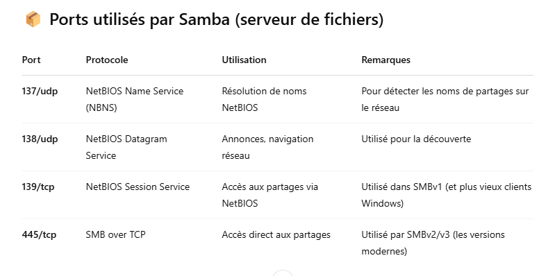

## Ports utilisés par Samba



Le port 445/tcp est le plus important aujourd’hui → il gère directement le protocole SMB.

Les ports 137–139 sont plutôt là pour la compatibilité avec les anciens clients Windows (NetBIOS).


## Vérifie les ports ouverts (sur ton serveur Samba) :
Tu peux utiliser une commande comme :

```bash
sudo netstat -tulnp | grep smbd
```

```bash
sudo ss -tuln | grep -E '137|138|139|445'
```


S'assurer que ces ports sont ouverts dans ton pare-feu si tu veux que des clients accèdent au partage depuis un autre poste.

```bash
sudo ufw allow proto tcp from any to any port 139,445
sudo ufw allow proto udp from any to any port 137,138
```

## Visualisation des logs

Voir les logs actifs

```bash
smbstatus
```

Contient les logs généraux du démon smbd (accès aux fichiers, erreurs, etc.).

```bash
cat /var/log/samba/log.smbd
```

Fichier de log des connexions utilisateurs

```bash
cat /var/log/samba/log.nmbd
```

Fichiers de logs par  utilisateur

```bash
cat /var/log/samba/log.william
```

Voir les logs en direct (suivi temps réel)

```bash
tail -f /var/log/samba/log.smbd
```

## 2 - CUPS 

### 2.1
La directive ```Location / ... </Location>``` ce bloc indique que les règles à l’intérieur ciblent la racine du serveur web, donc toutes les pages.

```Order allow,deny``` signifie que la politique d'accès va autoriser d'abord, puis refuser tous les autres. Cela veut dire : seuls les hôtes explicitement autorisés peuvent accéder.

```Allow from 192.168.100.152``` et  ```Allow from 192.168.100.153``` signifie que seules ces deux adresses IP (machines sur le réseau local) sont autorisées à accéder au serveur.

```AuthType Default``` spécifie le type d'authentification utilisé, ici la configuration par défaut (nom d’utilisateur + mot de passe).

```Require user @SYSTEM``` signifie que seuls les utilisateurs système (souvent définis dans un fichier de mot de passe ou PAM) peuvent se connecter.

### 2.2

```<Location /admin> ... </Location>```:  ce bloc indique que les règles à l’intérieur s’appliquent à l’URL /admin.


```Order allow,deny``` est une directive de contrôle d’accès. Elle précise l’ordre dans lequel les règles Allow et Deny sont évaluées.
Apache applique les règles Allow. Ensuite, il applique les règles Deny.
Si une adresse IP n’est pas explicitement autorisée, elle sera refusée par défaut.

```Allow from 192.168.100.152``` et  ```Allow from 192.168.100.153``` : ces directives permettent l’accès à l’URL /admin uniquement à ces deux adresses IP locales.

```AuthType Default``` spécifie le type d'authentification utilisé, ici la configuration par défaut (nom d’utilisateur + mot de passe).

```Require user @SYSTEM``` signifie que seuls les utilisateurs système (souvent définis dans un fichier de mot de passe ou PAM) peuvent se connecter.

### 2.3

Dans la zone d'administration, on peut : 

1. Ajouter et configurer des imprimantes

    - Détection automatique des imprimantes (USB, réseau, etc.)

    - Ajout manuel d’imprimantes IPP, LPD, SMB (Windows), JetDirect, etc.

    - Choix du pilote (PPD), configuration du nom, emplacement, options par défaut.

2. Gérer les files d’attente d’impression :

    - Voir les travaux en cours ou en attente

    - Supprimer, mettre en pause ou relancer des impressions

    - Afficher les journaux d’activité

3. Gérer les utilisateurs et les droits :

    - Définir qui peut imprimer, qui peut gérer les travaux ou les imprimantes

    - Restreindre certaines imprimantes à des utilisateurs/groupes spécifiques

4. Modifier les paramètres serveur CUPS

    - Activer/désactiver l'impression à distance

    - Partager les imprimantes sur le réseau

    - Configurer l’accès à l’interface web elle-même

    - Définir les ports d'écoute, les logs, etc.

5. Installer et gérer les pilotes et PPD

    - Ajouter des fichiers PPD personnalisés pour des modèles d’imprimantes spécifiques

    - Modifier les options de configuration liées au pilote (duplex, qualité, etc.)

6. Gérer la sécurité et les accès

    - Activer l’authentification pour certaines actions

    - Configurer les règles d’accès par IP ou utilisateur

    - Utiliser HTTPS avec certificat si besoin